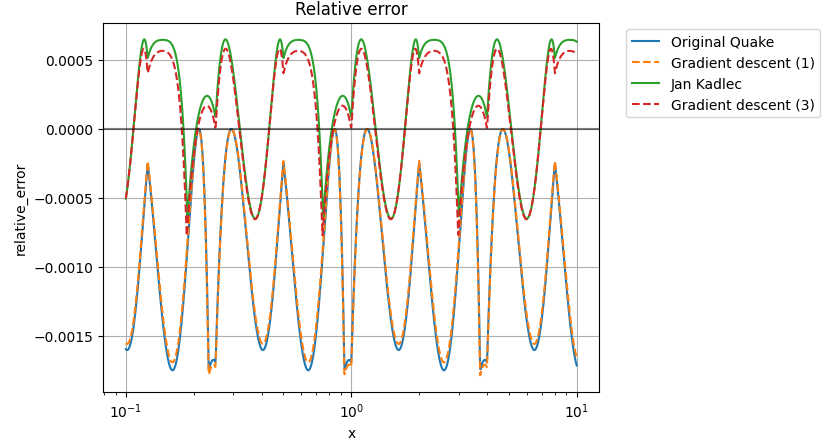

# Introduction
Explanation and derivation of fast inverse square root from Quake.
- Benchmark relative error.
- Derive single parameter in original Quake implementation
- Derive three parameters in extended form by Jan Kadlec

## Results


## Compiling code
1. Configure cmake: ```cmake . -B build --preset windows-msvc-avx2 -DCMAKE_BUILD_TYPE=Release```
2. Build applications: ```cmake --build build```
3. Run applications: ```./build/*.exe```

## Running Jupyter notebook
1. Install python.
2. Create virtual environment: ```python -m venv venv```.
3. Activate virtual environment: ```source ./venv/Scripts/activate```.
4. Install packages: ```pip install numpy matplotlib tabulate jupyter```.
5. Start notebook: ```jupyter-notebook .```.
6. Run notebook and execute cells.
